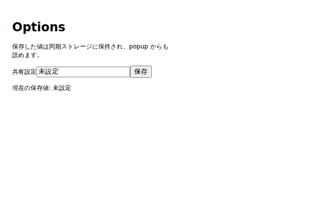

# crx-vite-ts-react-template

[](https://github.com/50ra4/crx-vite-ts-react-template/actions/workflows/ci.yml)
[](../LICENSE)

[English](../README.md) | **日本語**

[Vite](https://ja.vitejs.dev/)、TypeScript、[React](https://ja.react.dev/)、
[CRXJS](https://crxjs.dev/vite-plugin) で構築した Chrome 拡張機能
(Manifest V3)のテンプレートです。4つの拡張サーフェス(popup、options、
background、content script)が、型付き messaging レイヤーと型付き storage
スキーマで接続された状態で同梱されており、`git clone` から Chrome Web Store
へのアップロードまでを支える検証・リリースパイプラインを備えています。

> 本ドキュメントの正本は英語版([README.md](../README.md))です。日本語版の
> 更新は遅れる場合があり、両者に差異がある場合は英語版が優先されます。

## Features

- **4つの MV3 サーフェスが動く状態で同梱** — popup、options ページ、
  background service worker、content script を
  [`src/entrypoints/`](../src/entrypoints) 配下にサーフェスごとのディレクトリで配置。
- **サーフェス間の型付き messaging** —
  [`src/lib/messaging/messages.ts`](../src/lib/messaging/messages.ts) に
  メッセージを1箇所定義するだけで、送信側・受信側の両方に型が付きます。
  実行時の payload ガードと `sender.id === chrome.runtime.id` の検証を内蔵。
  ランタイム依存はゼロです。
- **型付き storage** — [`src/lib/storage/schema.ts`](../src/lib/storage/schema.ts)
  にキー(保存先 area + デフォルト値)を宣言すると、型付きの
  `get` / `set` / `remove`、変更購読、React hook(`useStorageValue`)が
  そのまま使えます。
- **アーキテクチャ境界の静的強制** — 実際の `chrome.*` 参照は `src/lib/` 内のみ
  許可。違反は Oxlint がエラーにするため、共有コードはテスト可能なまま、
  サーフェス間は疎結合に保たれます。
- **3層の検証** — Vitest ユニットテスト(jsdom + in-memory の `chrome` fake)、
  ビルド成果物 manifest の検証
  ([`scripts/verify-manifest.mjs`](../scripts/verify-manifest.mjs))、
  実 Chromium 上でビルド済み拡張を検証する Playwright スモークテスト。
- **契約としての最小権限** — permissions / host_permissions / CSP は
  `verify-manifest.mjs` で固定。権限を増やす変更は必ず許可リストの diff として
  可視化され、`externally_connectable` は宣言自体を拒否します。
- **再現可能なパッケージングとタグ駆動リリース** — `npm run package` で検証済みの
  `extension.zip` を生成。`v*` タグの push で全チェックを実行し、zip を添付した
  GitHub Release を公開します。
- **AI エージェント対応** — [`AGENTS.md`](../AGENTS.md) に設計契約・検証契約を
  明文化しており、コーディングエージェント(と人間)が安全に変更できます。

## Screenshots

| Popup                           | Options                             |
| ------------------------------- | ----------------------------------- |
|     |     |

## Requirements

- Node.js `>=24.0.0`([`.nvmrc`](../.nvmrc) は 24 を指定)
- Google Chrome または Chromium(手動確認と E2E に使用)

## Quick start

1. GitHub の **Use this template** から自分のリポジトリを作成(またはこの
   リポジトリを直接 clone)し、依存関係をインストールします。

   ```sh
   git clone https://github.com/<your-account>/<your-extension>.git
   cd <your-extension>
   npm ci
   ```

   `npm ci` は husky の pre-commit フックもインストールし、commit 時に staged
   ファイルの lint / format が実行されます。

2. dev サーバを起動します。

   ```sh
   npm run dev
   ```

   CRXJS が開発ビルドを `dist/` に書き出し、Vite dev サーバと接続して HMR が
   有効になります。

3. Chrome に読み込みます: `chrome://extensions` を開き、**デベロッパーモード**を
   有効化して「**パッケージ化されていない拡張機能を読み込む**」で `dist/`
   ディレクトリを選択します。拡張は `[DEV]` 接頭辞付きの名前で表示されます。

4. 動作確認: ツールバーのアイコンで popup を開き、拡張の詳細画面から options
   ページを開き、`https://example.com` で content script を確認します。
   `src/entrypoints/popup/popup.tsx` を編集すると popup にホットリロードで
   反映されます。

本番ビルドは `npm run build` で `extension/` に出力されます。同じ手順で
unpacked 読み込みして確認できます。

## Development

| サーフェス     | エントリファイル                           | 説明                                                                        |
| -------------- | ------------------------------------------ | --------------------------------------------------------------------------- |
| Popup          | `src/entrypoints/popup/popup.tsx`          | `popup.html` から読み込み。共有 storage 値を表示し、background へ型付きメッセージを送信。 |
| Options ページ | `src/entrypoints/options/options.tsx`      | `options.html` から読み込み。設定を `chrome.storage.sync` に保存。          |
| Background     | `src/entrypoints/background/background.ts` | MV3 service worker。型付きメッセージハンドラを登録。                        |
| Content script | `src/entrypoints/content/sample.tsx`       | `https://example.com/*` に注入(`manifest.config.ts` 参照)。               |

manifest は手書きではなく、[`manifest.config.ts`](../manifest.config.ts) から
`@crxjs/vite-plugin` がビルド時に生成します。Chrome の表示名は kebab-case の
npm パッケージ `name` とは独立した `package.json` の `displayName` から取得します。
dev モードでは表示名に `[DEV]` 接頭辞が付き、dev 用アイコンが使われるため、
開発ビルドと本番インストールを共存させられます。`index.html` は popup / options
へのリンクを持つ dev 専用のランチャーページで、拡張本体には含まれません。

DevTools パネルのサーフェスは意図的に含めていません。必要な場合は
[chrome.devtools 公式ドキュメント](https://developer.chrome.com/docs/extensions/reference/api/devtools)
と `.claude/skills/add-entrypoint/SKILL.md` を参照してください。

## Testing and verification

| コマンド                  | 内容                                                                     |
| ------------------------- | ------------------------------------------------------------------------ |
| `npm test`                | Vitest ユニットテスト(jsdom。watch は `npm run test -- --watch`)       |
| `npm run e2e`             | 実 Chromium でビルド済み拡張を検証する Playwright スモークテスト         |
| `npm run lint`            | Oxlint(検査のみ。`chrome.*` 境界ルールを含む)                          |
| `npm run format`          | Prettier(ファイルを書き換え)                                           |
| `npm run check-type`      | `tsc --noEmit`                                                           |
| `npm run verify:manifest` | ビルド成果物 `extension/manifest.json` を固定の許可リストと照合          |
| `npm run verify`          | check-type → lint → test → build → verify:manifest を直列実行            |
| `npm run verify:full`     | `verify` + `e2e` — フルの検証契約                                        |

補足:

- E2E は初回のみ Chromium のインストールが必要です:
  `npx playwright install chromium`
- E2E は dev サーバではなく**ビルド成果物**を読み込むため、先にビルドします:
  `npm run build && npm run e2e`
- コード変更後は `npm run verify` の1コマンドで安全性を証明できます。
  エントリポイントや messaging、manifest などランタイム配線に影響する変更は
  `npm run verify:full` を実行してください。

CI([`.github/workflows/ci.yml`](../.github/workflows/ci.yml))は `main` への
push とすべての pull request で同じチェック(type check、lint、unit test、
build + manifest 検証、実 Chromium E2E)を実行します。

## Architecture

```
src/
├── entrypoints/   # 拡張サーフェスごとに1ディレクトリ
│   ├── popup/
│   ├── options/
│   ├── background/
│   └── content/
├── lib/           # 共有モジュール: 型付き messaging / storage、テスト用 fake
│   ├── messaging/
│   ├── storage/
│   └── testing/
└── examples/      # サンプル(components / hooks / utils)。丸ごと削除可
```

依存方向の規約(可能な範囲で静的に強制。詳細は
[`src/lib/README.md`](../src/lib/README.md)):

- 許可される依存方向は `entrypoints → lib` のみ。`lib` から `entrypoints` への
  import は禁止。
- entrypoints 同士の直接 import は禁止。サーフェスは別々のランタイムコンテキスト
  であり、通信は型付き messaging レイヤー経由で行います。
- 実際の `chrome.*` 参照は `src/lib/` 内のみ。外側で `chrome` グローバルを参照
  すると Oxlint **エラー**になります。必要なら `src/lib/` に薄いラッパーを
  追加してください。`@types/chrome` による型参照は全域で許可。やむを得ない例外は
  理由を明記した `oxlint-disable` コメントを付けます。

よくある変更:

- **メッセージ型の追加**: `src/lib/messaging/messages.ts` に
  `defineMessage(...)` のエントリを1つ追加し、
  `src/entrypoints/background/background.ts` でハンドラを登録、任意の
  サーフェスから `sendMessage(name, payload)` で送信します。
- **storage キーの追加**: `src/lib/storage/schema.ts` の `AppStorageValues` と
  `storageSchema` にキーを追加すると、型付きアクセサと `useStorageValue` hook が
  自動で追従します。
- **サーフェスの追加**: `.claude/skills/add-entrypoint/SKILL.md` を参照。

### 自分の拡張への改変

テンプレートは再利用可能な基盤(`src/lib/`)とサンプルコードを分離しています。

1. `src/examples/` を丸ごと削除します。外部から import されていません。
2. `src/entrypoints/` のサンプル UI(popup / options / content)と `greet`
   サンプルメッセージを自分の機能に置き換えます。
3. `package.json` の npm パッケージ用 `name`、Chrome の人間可読な製品名用
   `displayName`、description、repository を更新し、`manifest.config.ts` の
   説明と `public/logo/` のアイコンも更新します。`displayName` がテンプレートの
   既定値のままなら `npm run verify:manifest` が警告します。
4. `manifest.config.ts` の content script `matches`(`https://example.com/*`)を
   変更または削除し、`scripts/verify-manifest.mjs` にも同じ変更を反映します
   (次節参照)。

完全なチェックリストは `.claude/skills/adapt-template/SKILL.md` にあります。

### Chrome 権限の追加

権限は暗黙の増加から保護されています。

1. `manifest.config.ts` の `permissions`(または `host_permissions` /
   `optional_permissions`)に権限を追加します。
2. `scripts/verify-manifest.mjs` の対応する許可リスト
   (`EXPECTED_PERMISSIONS`、`EXPECTED_HOST_PERMISSIONS` など)を更新します。
3. `npm run verify` を実行します。ビルド成果物の manifest と許可リストの不一致で
   `verify:manifest` が失敗するのは**仕様**であり、すべての権限変更が
   レビュー可能な diff として現れます。

同スクリプトは CSP を `script-src 'self'; object-src 'self';` に固定し、
`externally_connectable` の宣言を拒否します。

## Packaging and release

- `npm run package` は build と manifest 検証を行い、`extension/` の配布対象
  ファイルだけを含む再現可能な `extension.zip` を生成します。同一のソース・
  Node バージョン・lockfile からは常に同一内容の zip が生成されます。
- リリースはタグ駆動です。バージョンを更新してマージ後、`v*` タグを push すると
  [Release workflow](../.github/workflows/release.yml) が type check、lint、
  unit test、packaging、実 Chromium E2E を再実行し、すべて成功した場合のみ
  `extension.zip` を添付した GitHub Release を公開します。手順の詳細は
  [docs/releasing.ja.md](./releasing.ja.md) を参照してください。
- Chrome Web Store への公開は意図的に手動です(Store API キーの管理を利用者に
  強いないため)。生成された `extension.zip` をデベロッパーダッシュボードから
  アップロードします。
  [公式の公開ガイド](https://developer.chrome.com/docs/webstore/publish)を
  参照してください。

## AI agent support

コーディングエージェント向けの設定レイヤーを同梱しています。

- [`AGENTS.md`](../AGENTS.md) — 常時ロードされる契約: アーキテクチャの
  不変条件、定型変更のレシピ、禁止変更、変更の安全性を証明する検証コマンド。
- [`CLAUDE.md`](../CLAUDE.md) — Claude Code 用エントリポイント(`AGENTS.md` を
  import するのみ)。
- `.claude/rules/` — 対象ファイル編集時に読み込まれる技術規約
  (TypeScript/React、Chrome 拡張、テスト)。
- `.claude/skills/` — 定型タスクの手順書(テンプレートの改変、サーフェス追加、
  リリース)。

常時ロードされるのは `AGENTS.md` のみで、残りは必要時に読み込む構成により
トークン消費を抑えています。

## Contributing

セットアップ・検証・PR の流れは [CONTRIBUTING.md](../CONTRIBUTING.md)、
脆弱性の私的報告は [SECURITY.md](../SECURITY.md) を参照してください。本
プロジェクトは [Contributor Covenant](../CODE_OF_CONDUCT.md) に従います。

## License

[MIT](../LICENSE)
